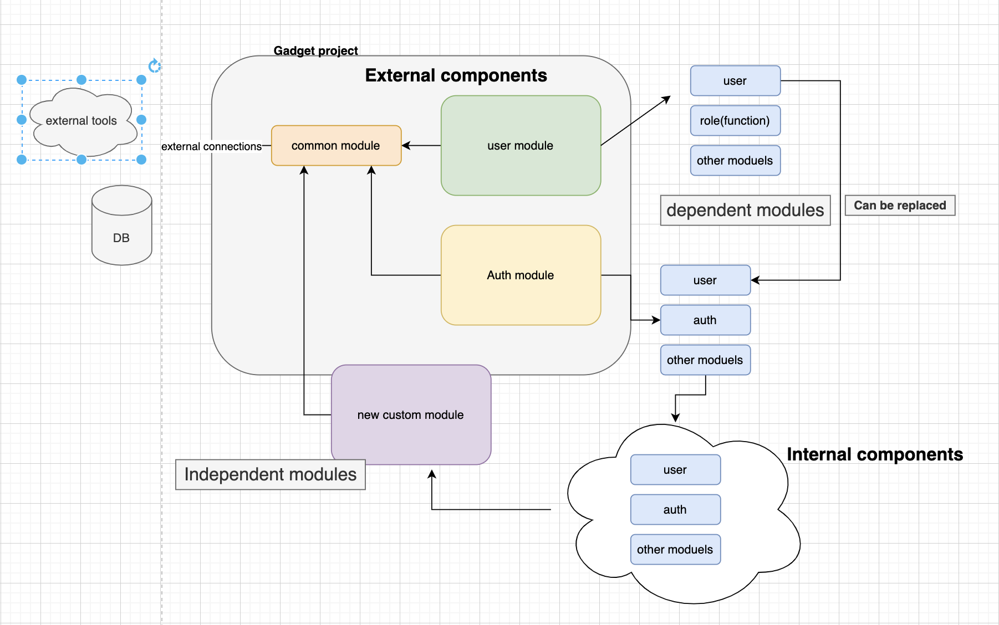

# Inspector Gadget
- In this project, we will save time to use it later =))
- default port is 3000
- Swagger for check APIs http://localhost:3000/api
- Add response sample per API added on swagger 

## Naming Concept

- [Gadget](https://en.wikipedia.org/wiki/Inspector_Gadget) is a cyborg (part man, part machine) with thousands of high-tech gadgets installed in his body. Gadget is powerful, lovable, caring, and protective, and loyal to his career as a lawman, but he is also dim-witted, clueless, incompetent, and gullible =)))) . In many ways Gadget was reminiscent of Maxwell Smart (also portrayed by Don Adams) from the Get Smart TV show,

## Project Structure - important !
- Please study carefully this part before use, 
- great thanks to dependency injection model in nest.js (only useful feature in nest.js =)) we can manage 
direct dependencies but in real-world we need manage dependencies in both code-level and abstraction to rich reusability
- we have 2 main concept in Gadget Architecture : "EXTERNAL COMPONENTS", "INTERNAL COMPONENTS"
- EXTERNAL COMPONENTS: independent and loosely coupled components and easily will setup without any consideration
- INTERNAL COMPONENTS: each EXTERNAL COMPONENTS includes couple of INTERNAL COMPONENTS that they may tightly coupled together and work with each other to build EXTERNAL COMPONENTS! we can't guarantee in-dependency between INTERNAL COMPONENTS
- Entire project we need to manage DB-connections, ports, configs, helpers, we have one EXTERNAL COMPONENTS for it that called "Common module" Common module always need to be imported during use both 
INTERNAL and EXTERNAL components
- In each INTERNAL COMPONENT specific READMe.md prepared to learn more about use-case of target module/component

- Overview of structure: 

## Description
- Gadget project is full of gadgets! i tried to prepare independent code-blocks
For easy copy and pase it in real project, its main purpose of project,
In other hand unfortunately in S-pro projects we have huge amount of dependencies to 
Ready tools like nest.js and Typeorm and etc,this will be main reason of project failures in long term

- In Gadget project i tried to prepare wrapper between tools and main code base
refer to [N-Tier](https://docs.microsoft.com/en-us/azure/architecture/guide/architecture-styles/n-tier#:~:text=An%20N%2Dtier%20architecture%20divides,not%20the%20other%20way%20around.) architectures
we need to prepare loosely coupled tiers/layers to make changes easy

- Some best patterns are common we use in 90% of projects we prepare them here

## Installation

Use the package manager [YARN](https://yarnpkg.com/cli/node) to install dependencies.

## Getting started
- if you only need  small code-blocks and INTERNAL components, its up to you about configuration
- don't forget to import common module in every component that you used  

- Note: this project will not run in production, 
only purpose of run project is test in local and dev env 

- do not forget to run the migrations!

```bash
# run migrations to create tables
npm run migration:up
# for easy run project 
 yarn start:dev

```

## Usage
- Please read structure and how to use section before this part,
 Its really important to know in details about gadget 
- Based on your requirements need to find your target external or internal component
- In some cases based on your needs you can combine several internal components together and use them as new custom component
- you can create new merge-request if you made reusable external-component that other devs on s-pro can use it in future!
- its up to you to set envs based on requirements, 
- some tools need configuration in main.ts and root of project in nest.js , this part will not be covered in gadget

## Support
- If there was any question you can create issue in this repository , we will come back to you soon! 
## Roadmap

In version 1.0.0 (first major version): 
- [x] User services components
- [x] Authentication components
- [X] Authorization components
- [X] Communication-chat components
- [x] Communication-mail components
- [ ] Notification components
- [ ] Testing tools components

In version 2.0.0 (): 
- [X] Cron-job components
- [ ] Admin 
- [ ] AWS-tools
- [ ] Payment-KYC components
- [ ] Payment-blockchain components
- [ ] Payment-banking-apis components

In version 3.0.0 (): 
- [ ] Encyclopedia components
- [ ] State-machine-handler components
- [ ] Elastic-Search components
- [ ] Common-pattern-integration-thirdParties components

In version 4.0.0 ():
- [ ] Remove dependency from Nest

## Contributing

- All of node.js expertise can contribute by:

- Prepare merge request for bug fixes
- Rich gadget repositories and add more features
- Report issues and bugs , we will fix them as soon as possible
- Request for new features that you need

- For contribution on code you need to prepare merge request to develop and mention on of 
Core members of project
All new end-points should be covered by tests (unit, e2e)
Documents for both new internal and external components should be provided
Please follow clean-code rules during contribution
## Authors and acknowledgment

- Great thanks from S-pro node.js finTech development team for support this project

## Project status

- Gadget is under develop! we need to develop more pre-builded components as much as possible
this will help to increase quality of projects and facilitate development  
